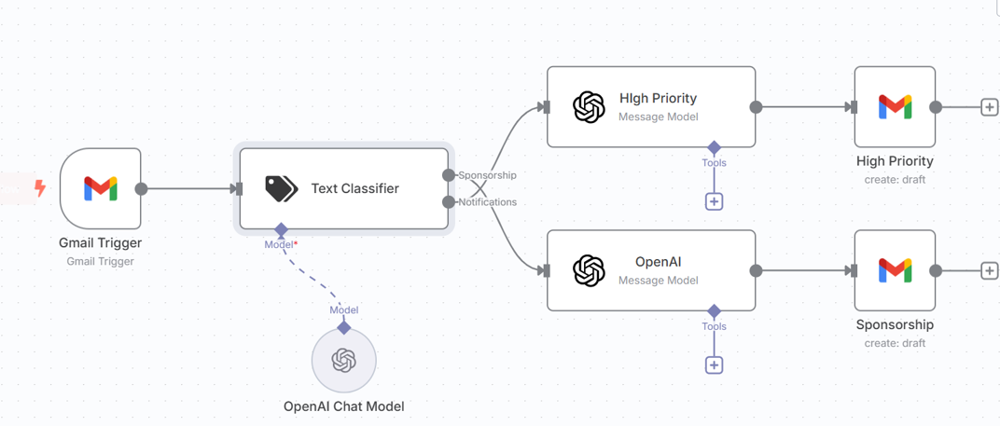

# ✉️ Email Draft AI Agent (n8n + OpenAI + Gmail)

This project is a smart email automation workflow built with [n8n](https://n8n.io/), integrating **Gmail**, **LangChain**, and **OpenAI GPT-4o** to auto-detect email intent and generate contextual reply drafts — all without sending the email, so you can review and edit before replying.

It was designed to help busy developers, founders, or sales professionals manage high-volume inboxes with intelligent AI support.

---

## 🔄 What It Does

- Polls your Gmail inbox every hour for new messages
- Classifies emails into:
  - **Sponsorship**
  - **High Priority**
  - **Normal (ignored)**
- Generates reply drafts using **GPT-4o-mini** based on the classification
- Saves those replies in **Gmail Drafts**, not sent automatically

---

## 📌 Requirements

To use this workflow, you’ll need to set up two credentials in your n8n instance:

---

### ✅ 1. Gmail OAuth2 Credential

> For polling and saving drafts in your Gmail inbox.

#### Steps:
- Go to [Google Cloud Console](https://console.cloud.google.com/)
- Create a new project or use an existing one
- Enable the **Gmail API**
- Create **OAuth 2.0 Client ID** credentials
  - App type: Web Application
  - Authorized redirect URI:  
    `https://your-n8n-instance.com/rest/oauth2-credential/callback`
- In n8n:
  - Create new credential → **Gmail OAuth2**
  - Paste in the Client ID and Secret
  - Authorize your Gmail account

---

### ✅ 2. OpenAI API Credential

> Used for GPT-4o responses to emails.

#### Steps:
- Go to [OpenAI API dashboard](https://platform.openai.com/api-keys)
- Copy your **API key**
- In n8n:
  - Create new credential → **OpenAI**
  - Paste the API key
  - Select `gpt-4o-mini` (or your preferred model)

---

## 🧠 Workflow Logic

| Node Name         | Function                                                                 |
|------------------|--------------------------------------------------------------------------|
| Gmail Trigger     | Checks inbox every hour for new messages                                 |
| Text Classifier   | Uses LangChain + AI to detect intent (Sponsorship, High Priority, etc.)  |
| OpenAI (x2)       | Generates draft replies with appropriate tone and structure              |
| Gmail Draft (x2)  | Saves response to your Gmail drafts folder                               |

Each category uses a different system prompt to generate the right tone and context — for example, sponsorship replies ask for budget/deliverables, while notifications are more formal.

---

## 🖼️ Preview

---

## 🚀 How to Use

1. Import the JSON file (`email-draft-ai-agent.json`) into n8n
2. Set up your **Gmail** and **OpenAI** credentials
3. Customize prompts or logic if needed
4. Activate the workflow
5. Let it run in the background — check Gmail drafts!

---

## 🔐 Security Note

- All communication with Gmail is secured using OAuth2
- OpenAI requests are made server-side using secure API keys
- Drafts are stored only in your Gmail — nothing is auto-sent

---

## 📚 Use Cases

- Solo developers managing sponsorship/collab requests
- Founders or CTOs fielding inbound leads
- DevOps teams responding to alert emails
- Professionals who want to automate routine email handling

---

## 🧑‍💻 Author

**Adnan Latif**  
Senior Software Engineer, DevOps & AI  
[LinkedIn](https://linkedin.com/in/adlatif) • [GitHub](https://github.com/AdnanLatif)

---

## 📂 Related Projects

Check out other automation workflows in this repo for Slack, Sheets, and more.

---

## 📝 License

MIT — feel free to use and modify.

