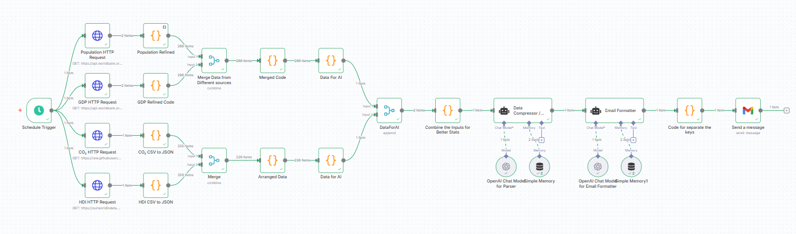

# GDP & Population Summary Dashboard — n8n Workflow

An automated **n8n workflow** that fetches global GDP and population data from multiple public sources, cleans and merges it, and generates a daily AI-powered summary report.

---

## Features

- Fetches GDP & population data from:
  - **World Bank API**
  - **Our World in Data**
  - **GitHub CSV datasets**
- Cleans and standardizes country codes, removes incomplete entries.
- Merges all data into a single JSON dataset.
- Uses an AI model to summarize key economic & demographic trends.
- Sends a daily report to your email with:
  - Human-readable AI summary
  - Raw merged dataset (as JSON attachment)

---

## How It Works

1. **HTTP Requests** — Retrieve GDP, population, and economic indicators from multiple sources.
2. **Code Nodes** — Clean, format, and standardize all datasets.
3. **Merge Node** — Combine everything into one unified structure.
4. **LLM Node** — Generate a natural language summary of the latest trends.
5. **Email Node** — Send the report and data to your inbox.

---

## Files

- `workflow.json` — The n8n workflow file (import directly into n8n).
- `title.png` — The title image for GitHub/Medium.
- `README.md` — This documentation.

---

## Setup

1. **Import the Workflow**

   - Open n8n, click **Import from file**, and select `workflow.json`.

2. **Add Your Credentials**

   - Replace any placeholder API keys or email addresses.
   - World Bank and OWID do not require authentication, but if you use other APIs, configure credentials in n8n.

3. **Configure Email Node**

   - Open the `Send Email` node.
   - Replace `you@example.com` with your real recipient address.

4. **Enable the Workflow**
   - Set a schedule trigger (e.g., once a day).

---

## Example Output

Example daily summary email:

> **Top Economies:** USA, China, Japan, Germany, India  
> **Fastest GDP Growth:** Rwanda, Bangladesh, Ethiopia...  
> **Most Populous:** China, India, USA, Indonesia, Pakistan

---

## License

MIT — feel free to fork, adapt, and share.

---

**Made with ❤️ using [n8n.io](https://n8n.io) and open data sources.**
