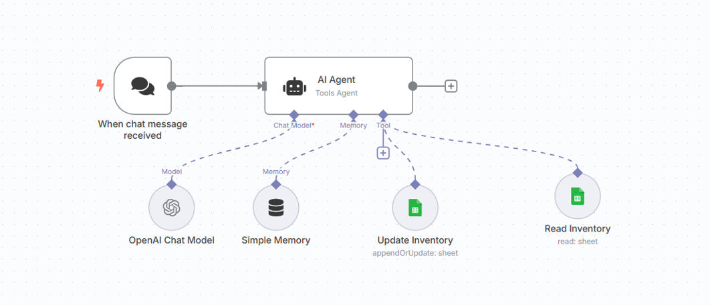

# 📦 Inventory Management AI System – Built with n8n, OpenAI, and Google Sheets

This n8n workflow automates real-time inventory management using AI. It connects Google Sheets with OpenAI to intelligently assess stock levels, generate human-like inventory alerts, and provide contextual suggestions for replenishment or surplus action.

---

---

## ✨ Features

- 🔄 Monitors inventory data in a Google Sheet
- 🧠 Uses OpenAI to analyze stock with human-like insight
- 📬 Sends AI-generated inventory alerts to Slack or email
- ✅ Perfect for warehouses, ecommerce, or operations teams

---

## 🧰 What You’ll Need

### APIs & Credentials

- **🔑 OpenAI API Key**  
  Get it from: [https://platform.openai.com/account/api-keys](https://platform.openai.com/account/api-keys)

- **📄 Google Sheets Access**  
  You need to:
  - Enable Google Sheets API
  - Use OAuth2 or Service Account key
  - Share your sheet with the service account email (if using service accounts)

---

## 🚀 How to Use

1. **Import the Workflow**  
   Download and import `inventory-management-ai-agent.json` into your n8n instance.

2. **Connect Credentials**

   - Link your **Google Sheets** node with a connected Google account.
   - Link your **OpenAI** node with your OpenAI API key.
   - Optional: Connect **Slack**, **Telegram**, or **Email** node for notifications.

3. **Prepare Your Sheet**

   - Must have columns: `Item Name`, `Quantity`, `Threshold`

4. **Trigger the Workflow**
   - It can be scheduled at intervals or triggered manually.
   - The workflow will pull inventory data, analyze it, and notify you about stock insights.

---

## 💡 Example Inventory Sheet

| Item Name | Quantity | Threshold |
| --------- | -------- | --------- |
| T-Shirts  | 20       | 25        |
| Hoodies   | 50       | 40        |

---

## 🧠 Sample AI Output

> 📦 **Inventory Summary**  
> Low Stock Alert: You're running low on **T-Shirts** (20 remaining; below 25 threshold).  
> ✅ **Hoodies** are in healthy stock. No action needed.

---

## ✅ Suggested Extensions

- Add integration with Shopify, WooCommerce, or Notion
- Connect with Telegram bot for real-time mobile alerts
- Build a weekly report digest with chart visualizations

---

## 🤖 Author

Built by [Adnan Latif](https://github.com/AdnanLatif)  
🧠 Follow my AI + automation series on [Medium](https://medium.com/@alatif.bwp)  
💼 Connect on [LinkedIn](https://www.linkedin.com/in/adlatif)
